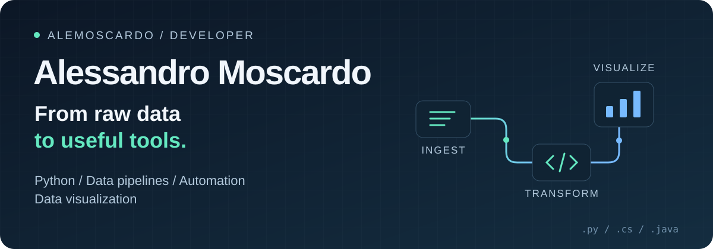

  

  
  &nbsp;
  

### A little about me

I write **Python scripts that automate repetitive processes**. I'm interested in the whole journey: preparing data, building reproducible pipelines, and making the results easier to explore through interactive applications.

My experience also reaches into **C#/.NET**, including refactoring an internal application to improve its structure and maintainability.

---

### Selected work
Four projects, from data workflows and backend services to mobile applications.

#### 01 &nbsp; / &nbsp; Finding patterns in football
**[Football Match Outcome Predictor ↗](https://github.com/alemoscardo/ml-football-predictions)**

From match statistics to Premier League outcome predictions. A reproducible training pipeline with shared feature engineering, temporal holdout evaluation, and a Streamlit app for exploring model results.

`Python` `Machine Learning` `Streamlit`

#### 02 &nbsp; / &nbsp; Giving CSV data an API
**[CSV CRUD API ↗](https://github.com/alemoscardo/csv-crud-fastapi-docker)**

A small, focused backend project: create, read, update, and delete CSV records through a FastAPI service, packaged with Docker for straightforward local setup.

`Python` `FastAPI` `Docker`

#### 03 &nbsp; / &nbsp; Turning sensor readings into alerts
**[SignalWatch ↗](https://github.com/alemoscardo/SignalWatch)**

An industrial telemetry API that stores sensor readings and raises alerts for stale, out-of-range, or rapidly changing values. A personal portfolio project built with fictional data.

`C#` `.NET 8` `PostgreSQL`

#### 04 &nbsp; / &nbsp; Exploring the world of games
**[GameBuzz ↗](https://github.com/alemoscardo/GameBuzz)**

An Android app developed in Java as a university team project to explore games using the IGDB API. Built with Retrofit for API requests, Firebase for authentication and data management, and Room for local storage.

`Java` `Android` `Firebase` `Retrofit` `Room`

---

### My toolbox

  
  
  
  
  
  
  
  

**Current focus:** Python automation · Data pipelines · Data visualization

  Have a project or an idea to discuss? <a href="https://www.linkedin.com/in/alessandro-moscardo/">Let's connect.</a>

